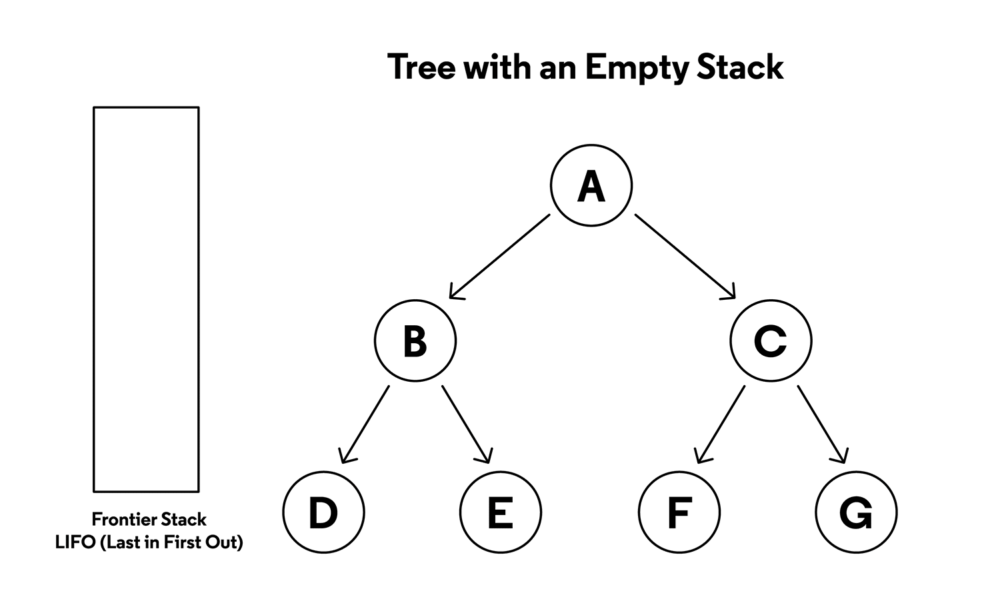

# Project 1 — Search (CS188 Pacman)

This README documents the Project 1 (Search) assignment, explains how each required function was implemented, and includes algorithm explanations.

# Welcome to Pacman

After downloading the code, unzipping it, and changing to the directory, you should be able to play a game of Pacman by typing the following at the command line:

```bash
python pacman.py
```

Pacman lives in a shiny blue world of twisting corridors and tasty round treats. Navigating this world efficiently will be Pacman’s first step in mastering his domain.

The simplest agent in searchAgents.py is called the GoWestAgent, which always goes West (a trivial reflex agent). This agent can occasionally win:

```bash
python pacman.py --layout testMaze --pacman GoWestAgent
```

If Pacman gets stuck, you can exit the game by typing CTRL-c into your terminal.

The agent can solve not only tinyMaze, but any maze you want.

Note that pacman.py supports a number of options that can each be expressed in a long way (e.g., --layout) or a short way (e.g., -l). You can see the list of all options and their default values via:
```bash
python pacman.py -h
```

Also, all of the commands that appear in this project also appear in commands.txt, for easy copying and pasting. In UNIX/Mac OS X, you can even run all these commands in order with bash commands.txt

The algorithms implemented are Depth-First Search (DFS), Breadth-First Search (BFS), Uniform-Cost Search (UCS), and A* search. The project also includes problem-specific code such as the CornersProblem and heuristics for A*.

Key notes and instructions (from the project specification):

- Implement search algorithms so they return a list of actions (legal moves) from the start state to a goal state.
- Use the `Stack`, `Queue`, and `PriorityQueue` classes from `util.py`.
- Implement the graph-search version of algorithms (keep an explored set to avoid revisiting states).
- Implement additional problem classes and heuristics: the `CornersProblem`, `cornersHeuristic`, `foodHeuristic`, and helpers such as `findPathToClosestDot`.


### Solving Search Problems:

#### Solution

A sequence of actions that leads from the initial state to the goal state.

#### Optimal Solution

A solution that has the lowest path cost among all solutions.

---

In a search process, data is often stored in a `node`, a data structure that contains the following data:

A `state`, its parent node, through which the current node was generated, `the action` that was applied to the state of the parent to get to the current node and the `path cost` from the initial state to this node

Nodes contain information that makes them very useful for the purposes of search algorithms. They contain a state, which can be checked using the goal test to see if it is the final state. If it is, the node’s path cost can be compared to other nodes’ path costs, which allows choosing the optimal solution. Once the node is chosen, by virtue of storing the parent node and the action that led from the parent to the current node, it is possible to trace back every step of the way from the initial state to this node, and this sequence of actions is the solution.

However, nodes are simply a data structure — they don’t search, they hold information. To actually search, we use the frontier, the mechanism that “manages” the nodes. The frontier starts by containing an initial state and an empty set of explored items, and then repeats the following actions until a solution is reached:

Repeat:

    If the frontier is empty,
        Stop. There is no solution to the problem.

    Remove a node from the frontier. This is the node that will be considered.

    If the node contains the goal state,
        Return the solution. Stop.

    Else,

    * Expand the node (find all the new nodes that could be reached from this node), and add resulting nodes to the frontier.
    * Add the current node to the explored set.

## Depth-First Search

In the previous description of the frontier, one thing went unmentioned. At stage 2 in the pseudocode above, which node should be removed? This choice has implications on the quality of the solution and how fast it is achieved. There are multiple ways to go about the question of which nodes should be considered first, two of which can be represented by the data structures of stack (in depth-first search) and queue (in breadth-first search; and here is a cute cartoon demonstration of the difference between the two).

We start with the depth-first search (DFS) approach.

A depth-first search algorithm exhausts each one direction before trying another direction. In these cases, the frontier is managed as a stack data structure. The catchphrase you need to remember here is “last-in first-out.” After nodes are being added to the frontier, the first node to remove and consider is the last one to be added. This results in a search algorithm that goes as deep as possible in the first direction that gets in its way while leaving all other directions for later.

(An example: Take a situation where you are looking for your keys. In a depth-first search approach, if you choose to start with searching in your pants, you’d first go through every single pocket, emptying each pocket and going through the contents carefully. You will stop searching in your pants and start searching elsewhere only once you will have completely exhausted the search in every single pocket of your pants.)

    Pros:
        At best, this algorithm is the fastest. If it “lucks out” and always chooses the right path to the solution (by chance), then depth-first search takes the least possible time to get to a solution.
    Cons:
        It is possible that the found solution is not optimal.
        At worst, this algorithm will explore every possible path before finding the solution, thus taking the longest possible time before reaching the solution.

Code example:

    # Define the function that removes a node from the frontier and returns it.
    def remove(self):
    	  # Terminate the search if the frontier is empty, because this means that there is no solution.
        if self.empty():
            raise Exception("empty frontier")
        else:
        	  # Save the last item in the list (which is the newest node added)
            node = self.frontier[-1]
            # Save all the items on the list besides the last node (i.e. removing the last node)
            self.frontier = self.frontier[:-1]
            return node

### Q1 (3 pts): Finding a Fixed Food Dot using Depth First Search:
In searchAgents.py, you’ll find a fully implemented SearchAgent, which plans out a path through Pacman’s world and then executes that path step-by-step. The search algorithms for formulating a plan are implemented by me.

First, test that the SearchAgent is working correctly by running:
```bash
python pacman.py -l tinyMaze -p SearchAgent -a fn=tinyMazeSearch
```

The command above tells the SearchAgent to use tinyMazeSearch as its search algorithm, which is implemented in search.py. Pacman should navigate the maze successfully.

### 1) search.depthFirstSearch(problem)

Code:

```python
def depthFirstSearch(problem: SearchProblem):
    stack = util.Stack()
    visited = []

    start = problem.getStartState()
    stack.push((start, []))
    
    while not stack.isEmpty():
        this, path = stack.pop()
        
        if this not in visited:
            visited.append(this)
            
            if problem.isGoalState(this):
                return path
            
            for neighbor, action, cost in problem.getSuccessors(this):
                if neighbor not in visited:
                    stack.push((neighbor, path + [action]))
```
- `visited` is a list maintained as the explored set to avoid revisiting states.
- Each stack element stores a tuple `(state, path)` where `path` is the list of actions from the start to that state.
- Pop a node, check goal; if not goal, push all unvisited successors with updated paths.

Notes: the code follows the graph-search version of DFS (it checks `visited` before expanding nodes). The implementation preserves the successor order returned by `getSuccessors`.



The depth-first search (DFS) algorithm in the depthFirstSearch function in search.py, the code should quickly find a solution for:

```bash
python pacman.py -l tinyMaze -p SearchAgent
python pacman.py -l mediumMaze -p SearchAgent
python pacman.py -l bigMaze -z .5 -p SearchAgent
```

The Pacman board will show an overlay of the states explored, and the order in which they were explored (brighter red means earlier exploration).


## Breadth-First Search

The opposite of depth-first search would be breadth-first search (BFS).

A breadth-first search algorithm will follow multiple directions at the same time, taking one step in each possible direction before taking the second step in each direction. In this case, the frontier is managed as a queue data structure. The catchphrase you need to remember here is “first-in first-out.” In this case, all the new nodes add up in line, and nodes are being considered based on which one was added first (first come first served!). This results in a search algorithm that takes one step in each possible direction before taking a second step in any one direction.

(An example: suppose you are in a situation where you are looking for your keys. In this case, if you start with your pants, you will look in your right pocket. After this, instead of looking at your left pocket, you will take a look in one drawer. Then on the table. And so on, in every location you can think of. Only after you will have exhausted all the locations will you go back to your pants and search in the next pocket.)

- Pros:
    This algorithm is guaranteed to find the optimal solution.

- Cons:
    This algorithm is almost guaranteed to take longer than the minimal time to run.
    At worst, this algorithm takes the longest possible time to run.

Code example:

    # Define the function that removes a node from the frontier and returns it.
    def remove(self):
    	  # Terminate the search if the frontier is empty, because this means that there is no solution.
        if self.empty():
            raise Exception("empty frontier")
        else:
            # Save the oldest item on the list (which was the first one to be added)
            node = self.frontier[0]
            # Save all the items on the list besides the first one (i.e. removing the first node)
            self.frontier = self.frontier[1:]
            return node

### 2) search.breadthFirstSearch(problem)

Code:

```python
def breadthFirstSearch(problem: SearchProblem):
    queue = util.Queue()
    visited = []

    start = problem.getStartState()
    queue.push((start, []))
    
    while not queue.isEmpty():
        this, path = queue.pop()
        
        if this not in visited:
            visited.append(this)
            
            if problem.isGoalState(this):
                return path
            
            for neighbor, action, cost in problem.getSuccessors(this):
                if neighbor not in visited:
                    queue.push((neighbor, path + [action]))
```

Explanation:
- Uses `util.Queue()` as the frontier (FIFO) to implement BFS.
- `visited` prevents revisiting states.


You can see the code working:
```bash
python pacman.py -l mediumMaze -p SearchAgent -a fn=bfs
python pacman.py -l bigMaze -p SearchAgent -a fn=bfs -z .5
```

The code should work equally well for the eight-puzzle search problem without any changes.

```bash
python eightpuzzle.py
```


## Greedy Best-First Search

Breadth-first and depth-first are both uninformed search algorithms. That is, these algorithms do not utilize any knowledge about the problem that they did not acquire through their own exploration. However, most often is the case that some knowledge about the problem is, in fact, available. For example, when a human maze-solver enters a junction, the human can see which way goes in the general direction of the solution and which way does not. AI can do the same. A type of algorithm that considers additional knowledge to try to improve its performance is called an informed search algorithm.

Greedy best-first search expands the node that is the closest to the goal, as determined by a heuristic function h(n). As its name suggests, the function estimates how close to the goal the next node is, but it can be mistaken. The efficiency of the greedy best-first algorithm depends on how good the heuristic function is. For example, in a maze, an algorithm can use a heuristic function that relies on the Manhattan distance between the possible nodes and the end of the maze. The Manhattan distance ignores walls and counts how many steps up, down, or to the sides it would take to get from one location to the goal location. This is an easy estimation that can be derived based on the (x, y) coordinates of the current location and the goal location.

### 3) search.uniformCostSearch(problem)

Code:

```python
def uniformCostSearch(problem: SearchProblem):
    queue = util.PriorityQueue()
    start = problem.getStartState()
    queue.push((start, [], 0), 0)
    frontier = {start: 0}

    while not queue.isEmpty():
        state, path, cost = queue.pop()
        if cost > frontier.get(state, math.inf):
            continue
        if problem.isGoalState(state):
            return path
        
        for successor, action, stepcost in problem.getSuccessors(state):
            new_cost = cost + stepcost

            if new_cost < frontier.get(successor, math.inf):
                frontier[successor] = new_cost
```


Explanation:
- Uses `util.PriorityQueue()` with the cumulative path cost as the priority.
- Maintains a `frontier` dictionary mapping states to their best-known cost in the frontier (g-values).
- When popping a state, if its cost is larger than the best known cost recorded, it is skipped (lazy deletion).
- For each successor, update if the new path has a lower cost and push into the priority queue.

### Manhattan Distance

However, it is important to emphasize that, as with any heuristic, it can go wrong and lead the algorithm down a slower path than it would have gone otherwise. It is possible that an uninformed search algorithm will provide a better solution faster, but it is less likely to do so than an informed algorithm.
A* Search

A development of the greedy best-first algorithm, A* search considers not only h(n), the estimated cost from the current location to the goal, but also g(n), the cost that was accrued until the current location. By combining both these values, the algorithm has a more accurate way of determining the cost of the solution and optimizing its choices on the go. The algorithm keeps track of (cost of path until now + estimated cost to the goal), and once it exceeds the estimated cost of some previous option, the algorithm will ditch the current path and go back to the previous option, thus preventing itself from going down a long, inefficient path that h(n) erroneously marked as best.

Yet again, since this algorithm, too, relies on a heuristic, it is as good as the heuristic that it employs. It is possible that in some situations it will be less efficient than greedy best-first search or even the uninformed algorithms. For A* search to be optimal, the heuristic function, h(n), should be:

Admissible, or never overestimating the true cost, and
Consistent, which means that the estimated path cost to the goal of a new node in addition to the cost of transitioning to it from the previous node is greater or equal to the estimated path cost to the goal of the previous node. To put it in an equation form, h(n) is consistent if for every node n and successor node n’ with step cost c, h(n) ≤ h(n’) + c.

## A* Search

A development of the greedy best-first algorithm, A* search considers not only h(n), the estimated cost from the current location to the goal, but also g(n), the cost that was accrued until the current location. By combining both these values, the algorithm has a more accurate way of determining the cost of the solution and optimizing its choices on the go. The algorithm keeps track of (cost of path until now + estimated cost to the goal), and once it exceeds the estimated cost of some previous option, the algorithm will ditch the current path and go back to the previous option, thus preventing itself from going down a long, inefficient path that h(n) erroneously marked as best.

Yet again, since this algorithm, too, relies on a heuristic, it is as good as the heuristic that it employs. It is possible that in some situations it will be less efficient than greedy best-first search or even the uninformed algorithms. For A* search to be optimal, the heuristic function, h(n), should be:

Admissible, or never overestimating the true cost, an consistent, which means that the estimated path cost to the goal of a new node in addition to the cost of transitioning to it from the previous node is greater or equal to the estimated path cost to the goal of the previous node. To put it in an equation form, h(n) is consistent if for every node n and successor node n’ with step cost c, h(n) ≤ h(n’) + c.

### 4) search.aStarSearch(problem, heuristic)

Code:

```python
def aStarSearch(problem: SearchProblem, heuristic=nullHeuristic):
    frontier = util.PriorityQueue()
    costs = {}
    start = problem.getStartState()

    frontier.push((start, [], 0), 0 + heuristic(start, problem))
    costs[start] = 0

    while not frontier.isEmpty():
        state, path, g_cost = frontier.pop()

        if g_cost > costs.get(state, math.inf):
        if problem.isGoalState(state):
            return path
This is a placeholder update to ensure file context.
        
        for successor, action, step_cost in problem.getSuccessors(state):
            new_cost = g_cost + step_cost

            if new_cost < costs.get(successor, math.inf):
                costs[successor] = new_cost
                new_path = path + [action]
                priority = new_cost + heuristic(successor, problem)
                frontier.push((successor, new_path, new_cost), priority)

    return None
```

Explanation:
- Uses a priority queue where priority = g(n) + h(n), combining path cost and heuristic.
- Tracks `costs` (g-values) for states to avoid re-expanding worse paths.
- On expansion, adds successors with updated g and priority values computed with the provided heuristic.


---

### 5) CornersProblem (in `searchAgents.py`)

The `CornersProblem` requires designing a state representation that encodes Pacman's position and which corners have been visited.

Implemented methods (code):

```python
class CornersProblem(search.SearchProblem):
    def __init__(self, startingGameState: pacman.GameState):
        self.walls = startingGameState.getWalls()
        self.startingPosition = startingGameState.getPacmanPosition() 
        top, right = self.walls.height-2, self.walls.width-2
        self.corners = ((1,1), (1,top), (right, 1), (right, top))
        ...

    def getStartState(self):
        """
        start state: (position, visitedCorners)
        visitedCorners is a tuple of corner positions visited so far (empty at start)
        """
        return (self.startingPosition, ())

    def isGoalState(self, state: Any):
        """
        Returns whether this search state is a goal state of the problem.
        """
        return len(self.corners) == len(state[1])

    def getSuccessors(self, state: Any):
        successors = []
        for action in [Directions.NORTH, Directions.SOUTH, Directions.EAST, Directions.WEST]:
            x, y = state[0]
            dx, dy = Actions.directionToVector(action)
            nextx, nexty = int(x + dx), int(y +dy)
            hitsWall = self.walls[nextx][nexty]
            if not hitsWall:
                next_position = (nextx, nexty)
                new_state = (next_position, state[1])
                if next_position in self.corners:
                    if next_position not in state[1]:
                        new_state = (next_position, (state[1] + (next_position,)))
                successors.append((new_state, action, 1))

        self._expanded += 1 # DO NOT CHANGE
        return successors
```

Explanation:
- Start state is a tuple (position, visitedCorners), with `visitedCorners` an empty tuple initially.
- `isGoalState` checks if the number of recorded visited corners equals the number of corner coordinates (i.e., all corners visited).
- `getSuccessors` returns neighbor states with cost 1. When moving to a corner not yet visited, it appends that corner to the `visitedCorners` tuple in the new state. The representation is immutable (tuples), so states on the frontier are independent.

### 6) cornersHeuristic(state, problem)

Code:

```python
def cornersHeuristic(state: Any, problem: CornersProblem):
    corners = problem.corners
    walls = problem.walls

    def manhattanDis(point1, point2):
        xy1 = point1
        xy2 = point2
        return abs(xy1[0] - xy2[0]) + abs(xy1[1] - xy2[1])
    
    def manhattanSum(pos, unseen, sum):
        if unseen == []:
            sums.append(sum)
        for item in unseen:
            tmp = list(unseen)
            tmp.remove(item)
            sum += manhattanDis(pos, item)
            manhattanSum(item, tmp, sum)
            sum -= manhattanDis(pos, item)
    
    sums = []
    unseen = []
    point = state[0]
    for corner in corners:
        if corner not in state[1]:
            unseen.append(corner)
    manhattanSum(point, unseen, 0)
    sum = min(sums)
    return sum
```

Explanation:
- This heuristic computes the minimal sum of Manhattan distances required to visit all remaining corners by enumerating permutations of unseen corners via recursion. It starts at the current position and computes the sum for each permutation of visiting the remaining corners, returning the minimal total Manhattan distance. This is admissible because Manhattan distances ignore walls and return an optimistic (under-)estimate of the true path cost.

Notes: The recursive permutation enumeration can be expensive if many corners remain; for the 4-corner problem this is acceptable.

### 7) foodHeuristic(state, problem)

Code:

```python
def foodHeuristic(state: Tuple[Tuple, List[List]], problem: FoodSearchProblem):
    position, foodGrid = state
    "*** YOUR CODE HERE ***"
    distances = []
    listgrid = foodGrid.asList()

    for food_cordinate in listgrid:
        if (position, food_cordinate) in problem.heuristicInfo:
            distances.append(problem.heuristicInfo[(position, food_cordinate)])
        else:
            value = mazeDistance(position, food_cordinate, problem.startingGameState)
            problem.heuristicInfo[(position, food_cordinate)] = value
            distances.append(value)

    if not distances:
        return 0
    return max(distances)
```

Explanation:
- For each remaining food dot, the heuristic uses `mazeDistance` (exact shortest path length in the maze, computed with the provided `PositionSearchProblem` + BFS) to compute the true distance from Pacman's current position to that dot. Distances are cached in `problem.heuristicInfo` to avoid recomputation.
- The heuristic returns the maximum of the distances to any food dot — i.e., the farthest dot's true distance. This is admissible because Pacman must at least travel that far to eat all dots, and it is consistent because actual path costs satisfy triangle inequalities.

### 8) Closest-dot helper: findPathToClosestDot & AnyFoodSearchProblem.isGoalState

Code (findPathToClosestDot):

```python
def findPathToClosestDot(self, gameState: pacman.GameState):
    startPosition = gameState.getPacmanPosition()
    food = gameState.getFood()
    walls = gameState.getWalls()
    problem = AnyFoodSearchProblem(gameState)

    "*** YOUR CODE HERE ***"
    return search.ucs(problem)
```

Code (AnyFoodSearchProblem.isGoalState):

```python
def isGoalState(self, state: Tuple[int, int]):
    x,y = state

    "*** YOUR CODE HERE ***"
    return state in self.food.asList()
```

Explanation:
- `AnyFoodSearchProblem` is a simple `PositionSearchProblem` variant whose goal test is: the current position is any food coordinate. The `isGoalState` implementation returns True if the current position is one of the food locations.
- `findPathToClosestDot` builds an `AnyFoodSearchProblem` from the current `gameState` and uses uniform-cost search (`search.ucs`) to return a shortest path to the nearest food dot. Using UCS ensures the returned path to the closest dot is optimal under unit costs.

